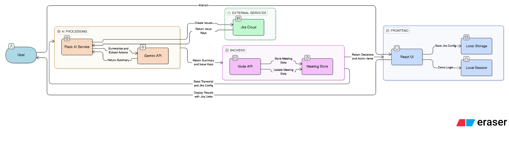
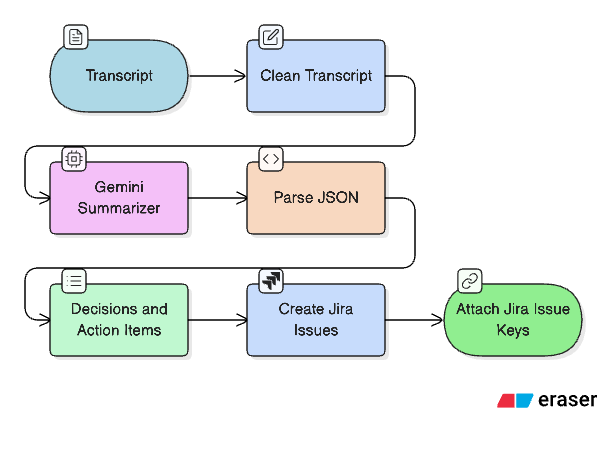
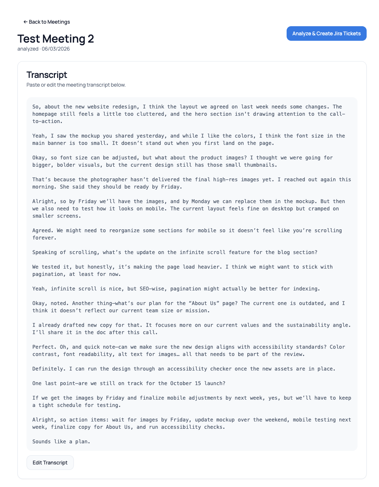
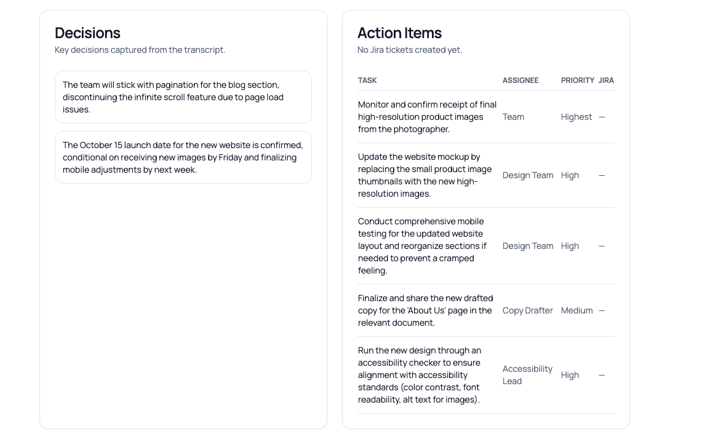
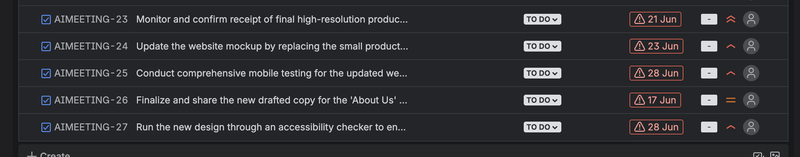

# Curia AI — Meeting → Jira Automation

Curia AI turns meeting transcripts into structured decisions and action items, then creates Jira tickets automatically. The current build ships a clean web UI and a working backend pipeline (React → Node API → Flask AI → Jira).

The meeting bot is planned for a later phase; this README focuses on the existing workflow.

**Highlights**
1. Demo login (no backend auth)
2. Jira credentials stored locally in the browser
3. Transcript analysis with Gemini
4. Jira tickets created and shown in the UI

**High-Level Flow**


**Transcript Analysis Flow**


**Repo Structure**
1. `backend/` — Flask AI service (Gemini + Jira integration)
2. `backend-node/` — Node API for meetings
3. `frontend/` — React UI
4. `samples/` — sample transcripts

## Setup

### 1) Backend (Flask AI)
```bash
cd /Users/hari/Documents/BMSCE-XCEL-TS100/backend
python -m venv .venv
source .venv/bin/activate
python -m pip install -r requirements.txt
python -m spacy download en_core_web_sm
```

Set your Gemini API key:
```bash
export GEMINI_API_KEY="YOUR_KEY_HERE"
```

Run Flask:
```bash
python app.py
```
Runs at `http://localhost:5002`

### 2) Backend (Node API)
```bash
cd /Users/hari/Documents/BMSCE-XCEL-TS100/backend-node
npm install
npm run dev
```
Runs at `http://localhost:5001`

### 3) Frontend (React)
```bash
cd /Users/hari/Documents/BMSCE-XCEL-TS100/frontend
npm install
npm run dev
```
Runs at `http://localhost:8080`

The frontend uses a dev proxy to `/api` → `http://localhost:5001`.

## Usage

1. Open the frontend in your browser.
2. Login with any email + password (min 4 chars).
3. Go to **Jira Settings** and save:
   - Jira URL (e.g., `https://yourteam.atlassian.net`)
   - Project Key (e.g., `CURIA`)
   - Jira Email
   - Jira API Token
   - Issue Type (optional, default: `Task`)
4. Create a meeting and paste a transcript.
5. Click **Analyze & Create Jira Tickets**.
6. Jira keys will appear in the Action Items table and also in Jira itself.

## Jira Notes
1. The Issue Type must exist in your Jira project (common values: `Task`, `Story`).
2. If Jira tickets fail to create, the UI will show an error banner with details.
3. Re-run analysis after saving Jira settings; old meetings won’t have Jira keys until analyzed again.

## Troubleshooting

**Flask fails with `ModuleNotFoundError: flask_cors`**
```bash
cd /Users/hari/Documents/BMSCE-XCEL-TS100/backend
python -m pip install -r requirements.txt
```

**AI summarization fails**
- Make sure `GEMINI_API_KEY` is set.
- Confirm your API key has access to `gemini-2.0-flash`.

**Jira tickets not created**
- Verify Jira URL, project key, email, API token.
- Check Issue Type matches Jira project (e.g., `Task`).
- Ensure the Jira account has permission to create issues.

## Future Work
- Meeting bot (auto-join, capture transcript)
- Real authentication (backend-managed users)
- Persistent meeting storage in a database


## Demo:
## Sample transcript: 



## Action Items:



## Jira DashBoard:

